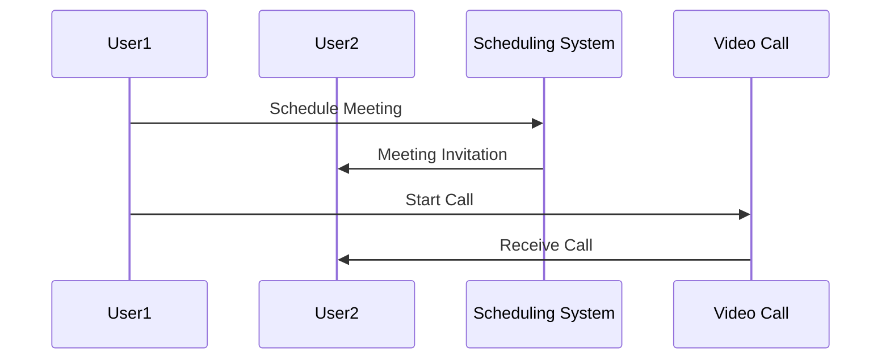

# Model Card for `mermaid-gemma-3-270m-it`

This model is a fine-tuned variant of [google/gemma-3-270m-it](https://huggingface.co/google/gemma-3-270m-it), specifically trained to transform natural-language descriptions into structured Mermaid diagram code.

## Example Input/Output

**Input**:
```
Design a sequence diagram for a video conferencing application, illustrating
interactions between users, scheduling system, video call establishment,
audio transmission, and chat messaging.
```

**Output**:


## Quick start

```python
from transformers import AutoModelForCausalLM, AutoTokenizer, pipeline

model = AutoModelForCausalLM.from_pretrained(
    "MrObiKenobi/mermaid-gemma-3-270m-it",
    device_map="auto",
    dtype="auto"
)
tokenizer = AutoTokenizer.from_pretrained("MrObiKenobi/mermaid-gemma-3-270m-it")

pipe = pipeline("text-generation", model=model, tokenizer=tokenizer)

prompt = "Design a sequence diagram for a login system with user, frontend, and backend."
messages = [{"role": "user", "content": prompt}]
formatted = tokenizer.apply_chat_template(messages, tokenize=False, add_generation_prompt=True)

output = pipe(formatted, max_new_tokens=256)
print(output[0]["generated_text"][len(formatted):])
```

## Training procedure

This model was trained using supervised fine-tuning (SFT) on the dataset [Celiadraw/text-to-mermaid](https://huggingface.co/datasets/Celiadraw/text-to-mermaid), using only 1,000 samples.

This work is intended as an academic exercise; however, we are confident that training on the full dataset would lead to significantly improved performance.

Please refer to the accompanying notebook for detailed fine-tuning procedures and configuration.

### Framework versions

- TRL: 0.27.1
- Transformers: 4.57.6
- Pytorch: 2.9.0+cu126
- Datasets: 4.0.0
- Tokenizers: 0.22.2

## Credits

Based on tutorial by Daniel Bourke: [Small LLM Fine-tuning Tutorial](https://www.youtube.com/watch?v=2hoNAr-id-E)

## Citations

Cite TRL as:
    
```bibtex
@misc{vonwerra2022trl,
	title        = {{TRL: Transformer Reinforcement Learning}},
	author       = {Leandro von Werra and Younes Belkada and Lewis Tunstall and Edward Beeching and Tristan Thrush and Nathan Lambert and Shengyi Huang and Kashif Rasul and Quentin Gallou{\'e}dec},
	year         = 2020,
	journal      = {GitHub repository},
	publisher    = {GitHub},
	howpublished = {\url{https://github.com/huggingface/trl}}
}
```